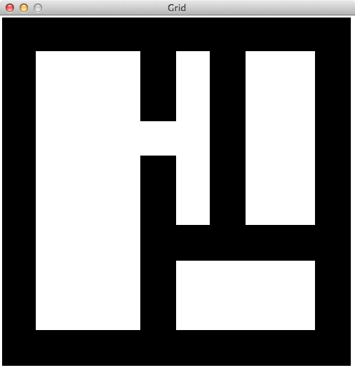
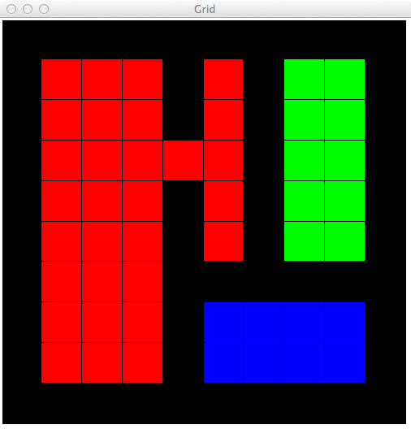
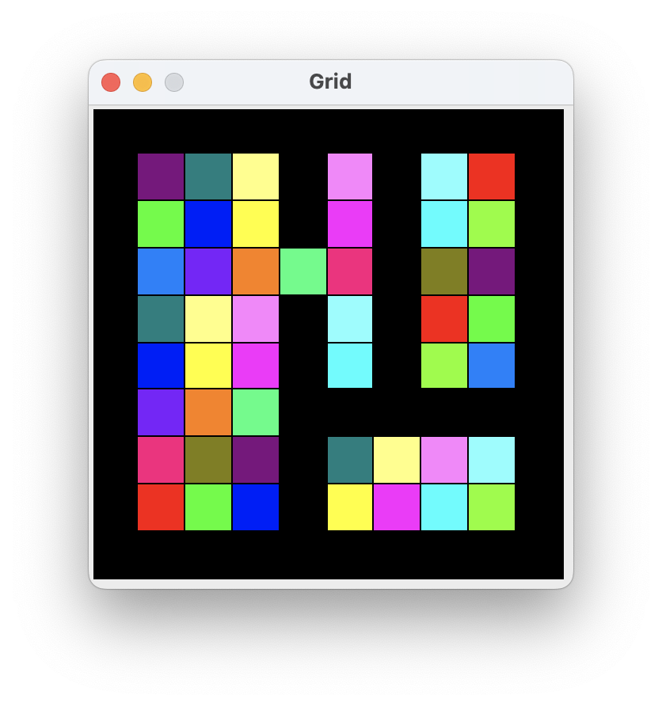
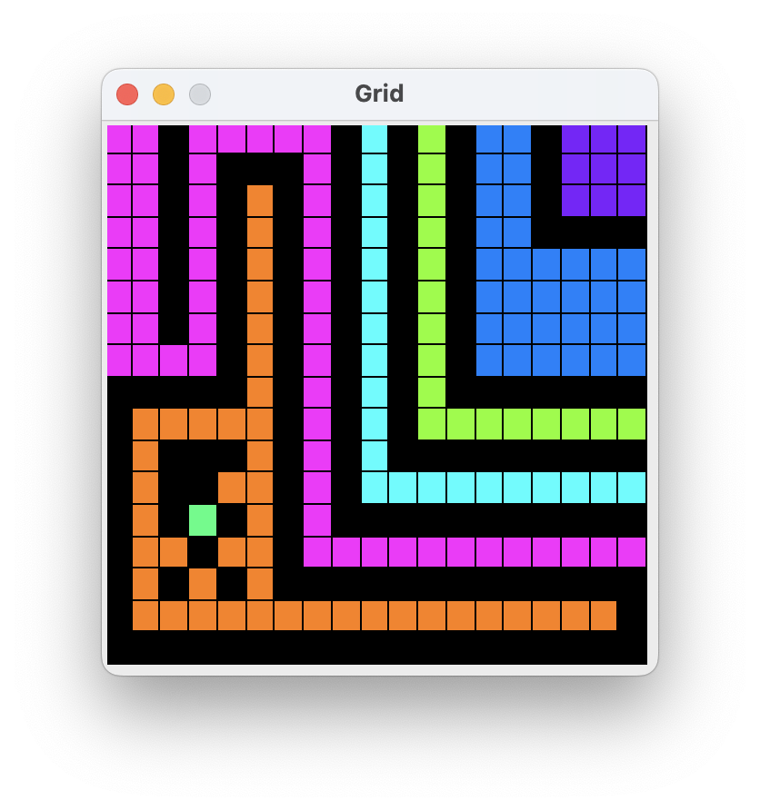

# HOWTO flood the cavern

This week's project is an introduction to solving problems using 
_recursive functions_, which are functions that can call themselves.

The project is based on a 2011 problem in the Juilfs programming 
competition.  The problem was to determine how many distinct 
"chambers" there are in a cave like this: 



You will be able to determine that this cave
has three chambers, indicated 
here by filling each chamber with a different color of water.



The cave will be represented as a grid, implemented as a list of 
lists of characters (type `str`).  Initially each cell in the grid 
will either be a well or an empty space.  You will look for empty 
cells using nested loops.  When you find an empty cell, you will 
pour water into it.  As you know, water naturally spreads out into a 
chamber.  You will write a recursive function to spread it out and 
fill the whole chamber. 

## The usual start

Start building `flood.py` in the usual way, with a header comment, 
import of the `doctest` module, and a main function that will 
execute when the module is run. 

```python
"""Flood-fill to count chambers in a cave.
CS 210 project.
<Your name here>, <date>
Credits: TBD
"""
import doctest


def main():
    doctest.testmod()
    
if __name__ == "__main__":
    main()
```

As usual, this skeleton of a program runs, but it doesn't do 
anything interesting yet. 


## Build and display a cave

A cave is a rectangular grid represented as a list of lists of 
single character strings.  Each cell in the grid (each string) 
represents air, stone, or water.  Initially the open spaces in the 
cave contain air. 

Caves are constructed from cave plans that look like this: 

```
cave 50 10 
hwall 5 0  10
vwall 0 5  50
```

The first line of this specification says that the cave will be 50 
rows, with 10 columns in each row.  Rows and columns are numbered 
like the indexes of a Python list, so the valid rows are 0 to 49, 
and the valid columns are 0 to 9.  

The second line says that the cave has a horizontal wall of stone 
beginning in the cell at row 5, column 0, and extending to the right 
across 10 cells.  

The third line says that the cave has a vertical wall starting in 
the cell at row 0, column 5, and extending downward across 50 cells.

If a stone wall does not pass through a cell in the cave, that cell 
contains air. 

I have provided a module `cave` (file `cave.py`) for building caves. 
We can get started by building a very small cave, based on the 
specification in `data/cave-rect.txt`.  We'll need to import the 
`cave` module in the usual way.  Then we'll use the `read_cave` 
function to read `data/cave-rect.txt`, and the `text` function to 
print it.  Since `cave` is the name of a module, I'll use `cavern` 
as the name of the particular cave we will explore: 

```python
def main():
    doctest.testmod()
    cavern = cave.read_cave("data/cave.txt")
    print(cave.text(cavern))
```

This should result in a primitive printed version of a narrow, deep 
cave: 

``` 
------------
|##########|
|#   # #  #|
|#   # #  #|
|#     #  #|
|#   # #  #|
|#   # #  #|
|#   ######|
|#   #    #|
|#   #    #|
|##########|
------------
```

## Factor out the cave description path

_Hard coding_ the path `data/cave-rect.txt` into our main program 
was handy for a quick check, but only for that.  We want our program 
to be usable with descriptions of different caves, without editing 
`flood.py`.  

We could prompt the user to provide a file name, but then we'd have 
to enter a path like `data/cave.txt` every time we ran it.  We 
could make it an application that gets the file path from the 
command line.  That might be the best approach, but we haven't 
studied command-line argument parsing with the `argparse` module yet.
Or we could just create a separate small module, `config`, to 
provide this information.  Creating a configuration file seems like 
a reasonable approach for now. 

Create `config.py` in the same directory as `flood.py`  and set a 
variable `CAVE_PATH` to `data/cave.txt`.  import `config` into 
`flood.py`.  Then our main function becomes:

```python
def main():
    doctest.testmod()
    cavern = cave.read_cave(config.CAVE_PATH)
    print(cave.text(cavern))
```

The program behavior should be the same as before. 

## A graphical view

I have also provided a module `cave_view` to provide a graphical 
depiction of the cave.  The functions of `cave_view` that we will 
need are `display`, to create the graphical view, and 
`prompt_to_close`, which we call when we are done to keep the 
graphic showing until the user presses _enter_.   Instead of 
printing `text(cavern)`, let's try displaying it.  Import 
`cave_view` and change the main function again, this time to: 

```python
def main():
    doctest.testmod()
    cavern = cave.read_cave(config.CAVE_PATH)
    cave_view.display(cavern, config.WIN_WIDTH, config.WIN_HEIGHT)
    cave_view.prompt_to_close()
```

You'll need to add configuration variables `WIN_WIDTH` and 
`WIN_HEIGHT` to `config.py`.  I used a 500 for both dimensions (500 
pixels wide by 500 pixels high), but you may prefer a larger or smaller 
window 
depending on the display of the computer you are using. 

Now instead of the textual representation, you should see something 
like this: 


## Checkpoint

At this point you should have two modules (source code files),
`flood.py` and `config.py`.  Your `flood.py` module imports
`config` as well as `cave` and `cave_view`.  

If you change `config.py` to contain a path to a different cave 
  description, you should get a diagram of a different cave.

## Scanning the cave

To count chambers, we will pour water into each chamber we find, 
while scanning every row and column of the cavern.  Every time we 
encounter air, we'll know that we've found another chamber, and then 
we'll pour water to fill that chamber up (while leaving air in other 
chambers). 

Let's do everything _except_ pouring water for now:  Scan each cell 
of the cavern and count the number of times we encounter air.  The 
header of the function should be: 

```python
def scan_cave(cavern: list[list[str]]) -> int:
    """Scan the cave for air pockets.  Return the number of
    air pockets encountered.

    >>> cavern_1 = cave.read_cave("data/tiny-cave.txt")
    >>> scan_cave(cavern_1)
    1
    >>> cavern_2 = cave.read_cave("data/cave.txt")
    >>> scan_cave(cavern_2)
    3
    """
```

Although you could write the nested `for` loops in the form
`for row in cavern:` and `for col in row:`, we will soon need the 
indexes of the cells for pouring water.  Instead, I suggest you 
write it using indexes, like `for row_i in range(len(cavern)):` and 
`for col_i in range(len(cavern[0])):`.  Then you can test whether 
you have encountered a cell containing air with the condition
`cavern[row_i][col_i] == cave.AIR`.  

Note that you must _NOT_ write `if cavern[row_i][col_i] == " ":`, 
even though you can tell by looking in `cave.py` that `cave.AIR` is 
a single space, `" "`, and even though it will work 
correctly if you do.  You must 
write your code as if someone could sneak into your code base at any 
moment and change the value of `cave.AIR` to something different. 
This is the principle of _information hiding_ that we have mentioned 
before.  Using the value `" "` directly, rather than refering to it 
by the symbolic name `cave.AIR`, is called _hard coding_ a
[_magic number_](
https://en.wikipedia.org/wiki/Magic_number_(programming))
(even though it's a string rather than a number).  Magic numbers are 
considered a very bad _code smell_.  

The first test case should succeed, as the air pocket in
`tiny_cave.txt` is just a single cell.  The second test case 
should fail:  Although there are just three large chambers in
`cave.txt`, each of those chambers contains several cells.  If we 
count the number of times we encounter a cell that contains air, we 
will count the number of empty cells rather than the number of 
chambers.  (I got 48.)

You could test for the "magic number" code smell by changing the value 
of `cave.AIR`.  Changing it to another value like `.` should not 
change the behavior of your program. 

You will call `scan_cave` from your `main` function: 

```python
chambers = scan_cave(cavern)
print(f"Found {chambers} chambers")
```

## Pour it on! 

Now all we need to do is to fill each chamber with water.  When we 
encounter a cell containing air, we'll still count it as a chamber, 
but then we'll flood it so that we don't count any more cells in 
that chamber.   

We can fill a single cell with water by assigning `cave.WATER` to 
that cell, e.g., `cavern[row_i][col_i] = cave.WATER`.  We can also 
show the water in our display with
`cave_view.fill_cell(row_i, col_i)`.  To help us visualize how the 
chambers are filling, we can change the color of water each time we 
encounter air, like this: 

```python
        fill(cavern, row_i, col_i)
        cave_view.change_water()
```

Our first version of `fill` can simply put water in the one 
discovered cell of air and update the corresponding area on the 
display: 

```python
def fill(cavern: list[list[str]], row_i: int, col_i: int):
    """Pour water into cell at row_i, col_i"""
    cavern[row_i][col_i] = cave.WATER
    cave_view.fill_cell(row_i, col_i)
```

Because we have not yet made the water spread, we will still get a 
count of air cells rather than chambers, and the visualization will 
show different colors in adjacent cells: 



## Checkpoint

Now your `flood.py` module contains a `main` function and two other 
functions, `scan_cave` and `fill`.  Only `scan_cave` contains loops.
Your `scan_cave` functions counts the number of times it encounters
`cave.AIR`.  Currently the result should be the number of grid cells
containing `cave.AIR`; we will change that shortly. 

## Let it flow

Now just need a way to let the 
water spread to fill the whole chamber. 

Although real water spreads in all directions, it will be enough for 
our simulated water to spread in four directions: up, down, left, 
and right.  If there is water in row _r_, column _c_, we can easily 
determine the row and column of the adjacent cells in each direction. 


It is tempting to try to write loops to fill cells in each direction.
If we were spreading water in just one direction, a loop would work 
well.  For spreading in all four directions, recursion is much 
easier.  We'll note this intent in the function header for `fill`:


```python
def fill(cavern: list[list[str]], row_i: int, col_i: int):
    """Fill the whole chamber around cavern[row_i][col_i] with water
    """
```


Recall that when we design a recursive function, we always
distinguish one or more _base_ cases and one or more _recursive_ 
cases.  A _base case_ is a problem that we can solve directly, 
without further recursion.  A _recursive case_ will make calls on 
the same function, but not on the same problem ... it must make the 
problem "smaller" or "simpler" in a way that, if repeated, leads 
inevitably to the base cases.  

What  can we identify as base cases 
and recursive cases for filling a chamber with water?

Sometimes the base case or cases are easy to identify, and provide 
the hints we need to design the recursive cases.  Sometimes it is 
the other way ... the recursive cases may be straightforward, and 
the base case(s) less obvious.  

For flood-fill, the recursive case seems to be the easier starting 
point.  We have already sketched it:  We fill one cell with water, 
and recursively call `fill` with the row and column of four 
neighboring cells.  But the recursive case must make _progress_ in 
the sense of making recursive calls only on "smaller" or "simpler" 
problems.  In what sense is the problem "smaller" or "simpler" when 
we make a recursive call to flood-fill from a neighboring cell?

We might also be worried about all the conditions under which we 
cannot fill a neighboring cell.  We can't pour water where there is 
a stone wall, and we don't want to pour water in the stone walls, 
but in addition we can't pour water outside the cavern, for example 
in a row or column with a negative index. We might be worried about 
how complicated our code will be if we consider all the relevant 
conditions before each of the recursive calls. 

Intuitively, each time we call `fill`, there should be fewer cells 
holding air than there were before.  This is a useful hint about the 
base cases.  We might initially think of checking, before each 
recursive call, that we are spreading into an air pocket.  For 
example, we might imagine that "spread the water upward" would be 
something like: 

```python
    row_up_i = row_i - 1
    if (row_up_i >= 0 and row_up_i < len(cavern)
        and cavern[row_up_i][col_i] == cave.AIR):
        fill(cavern, row_up_i, col_i)
```

We could imagine variations on this complicated check for all four 
directions, so that we only spread water into cells containing air. 
But if the "progress" condition is that we have reduced the number 
of cells containing air, then the guarantee that recursion must 
eventually stop is that we must run out of cells containing air.  
This suggests that the base case could be "this is not a cell 
containing air".  In other words, we don't need to make _four_ tests 
to see whether we can spread up, down, left, and right.  We can make 
just _one_ test at the beginning of function. 

Not this pseudocode: 

```
    fill this cell with water
    if there is an air cell above: 
        recursively call fill on the cell above
    if there is an air cell below: 
        recursively call fill on the cell below
    if there is an air cell to the left: 
        recursively call fill on the cell left
    if there is an air cell to the right: 
        recursively call fill on the cell right
```

but this simpler, shorter pseudocode: 

```
    if this a cell in the grid, and it contains air: 
        fill this cell with water
        recursively call fill on the cell above
        recursively call fill on the cell below
        recursively call fill on the cell left
        recursively call fill on the cell right
    else:
        just return without doing anything
```

Now we just need to write one condition that checks both whether the 
row and column are within the proper range and, if they are, whether 
the current content of the cell at that row and column contain air. 
Opportunities for error are fewer, and if we _do_ make a mistake, it 
will be easier to debug.  The code is simpler to read and understand,
and easier to write.  

If you can turn that pseudocode into Python, you will have a program 
that properly counts chambers and fills each chamber with a different 
color of water: 


You can try with some of the other cave specifications in the `data` 
directory, or create some of your own. The twisty cave 
(`data/twisty-cave.txt`) checks that water can spread along more 
complicated routes: 



In addition to the expected visualization, the `scan_cave` function 
should now be returning the correct count of cave chambers and 
passing its test cases.  Check that it finds 7 chambers in the 
twisty cave. 

## Checkpoint

Your program now contains the same functions as at the last 
checkpoint, but function `fill` has been changed to recursively 
spread water up, down, left, and right.   Function fill should be 
simple.  Mine is 10 lines, including an `if` condition that
I broke into three lines for readability.  It does _not_ contain any 
`for` or `while` loops, only recursive calls.  

Although we haven't changed `scan_cave` at all, it should now be 
returning the number of air _chambers_ in the cave, rather than the 
number of cave cells containing air. 

If this describes your program, you have completed the assignment 
and can turn in `flood.py`. 

## Challenge yourself: Improve the visualization

Your program is already complete. 
Read on if you are interested in using graphics and other user 
interface techniques to make programs more useful and usable. 

There is a `FIXME` comment in `graphics/grid.py`: 

``` 
FIXME: The color wheel should produce colors of contrasting brightness
as well as hue, to maximize distinctness for dichromats (people with 
"color blindness").  Maybe generating a good color wheel can be part 
of a project later in CS 210.   (This is not a required or expected
change for the week 5 project.)
```

The current palette of colors is defined using 
intensity of red, green, and blue channels (the "RGB" color space):

```python
color_wheel = [
    color_rgb(255,0,0), color_rgb(0,255,0), color_rgb(0,0,255),
    color_rgb(255,255,0), color_rgb(255,0,255), color_rgb(0,255,255),
    color_rgb(127,255,0), color_rgb(0,127,255), color_rgb(127,0,255),
    color_rgb(255,127,0), color_rgb(0,255,127), color_rgb(255,0,127),
    color_rgb(127,127,0), color_rgb(127,0,127), color_rgb(0,127,127),
    color_rgb(255,255,127), color_rgb(255,127,255), color_rgb(127,255,255) ]
```

If you are familiar with color spaces, you might consider how to 
design the color wheel in HSB (hue, saturation, and brightness) 
color space to get sufficient contrast in saturation and brightness 
for people who cannot distinguish by hue.  If you are not familiar 
with color spaces, you can think of brightness as the sum of the red,
green, and blue components, and saturation as their difference. 

For a better, more systematic adaptation to common differences in 
visual perception, we need to understand those 
differences. Designing usable interfaces requires understanding the 
ways people use those interfaces, so specialists in usability often 
study psychology as well as computing.  You can find some notes on 
designing for variations in color perception in
[this article by a usability specialist](
https://www.uxmatters.com/mt/archives/2007/02/ensuring-accessibility-for-people-with-color-deficient-vision.php).

[Accessibility standards for the world wide web](
https://www.w3.org/standards/webdesign/accessibility)
are maintained by the W3 Consortium.  They are useful reading also 
for developers of other kinds of application. 

If you want to really challenge yourself in thinking about interface 
design, consider how you would rework the "visualization" to work 
for people with limited vision.  Many people with blindness or 
limited vision use audio interfaces, including screen readers like
[JAWS](https://www.freedomscientific.com/products/software/jaws/)
or
[VoiceOver](https://www.apple.com/voiceover/info/guide/_1121.html).
Can you imagine substituting an audio interface for the 
visualization?  What considerations would go into its design?  How 
would you evaluate it?

We don't yet have the programming techniques for making it easy to 
attach different or varied user interfaces for the same 
functionality.  We will study program structures for more dynamic 
connection of user interface with functionality in the next term. 


